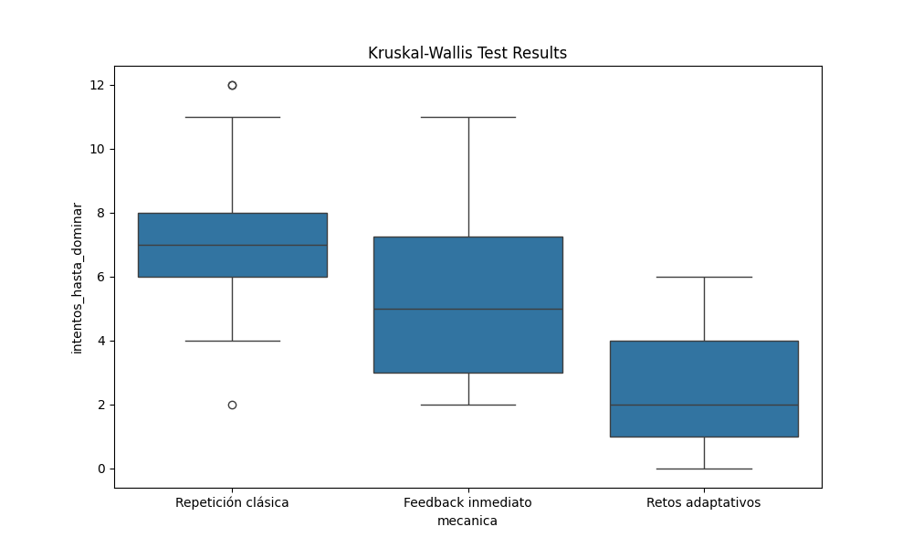

# 📊 Informe de Resultados: Prueba de Kruskal-Wallis sobre Mecánicas Educativas

## 1. Introducción

El objetivo de este análisis es evaluar y comparar distintas mecánicas educativas en un proyecto de tesis, utilizando datos sintéticos para simular el comportamiento esperado de los usuarios antes de la implementación completa del sistema.

El análisis se centra en tres mecánicas:

* Repetición clásica
* Feedback inmediato
* Retos adaptativos

Se evaluaron tres variables representativas del esfuerzo y la carga de los estudiantes:

* `intentos_hasta_dominar`: número de intentos necesarios para dominar la mecánica
* `tiempo_total_min`: tiempo total estimado para completar la actividad (en minutos)
* `carga_cognitiva_likert`: carga cognitiva percibida, medida en escala Likert (1-5)

## 2. Prueba de Kruskal-Wallis

### 2.1 Qué es la prueba

La prueba de **Kruskal-Wallis** es un test estadístico no paramétrico que permite comparar **tres o más grupos independientes** para determinar si existen diferencias significativas entre sus distribuciones.

Se utiliza principalmente cuando:

* Las variables no siguen una distribución normal
* Se tienen datos ordinales o con outliers
* Se desea comparar más de dos grupos

La hipótesis nula (H₀) establece que **las distribuciones de todos los grupos son iguales**, mientras que la hipótesis alternativa (H₁) indica que **al menos un grupo difiere de los demás**.

### 2.2 Aplicabilidad

En este proyecto, Kruskal-Wallis se aplica para:

* Comparar mecánicas educativas usando **datos sintéticos**, simulando comportamiento esperado
* Detectar diferencias de diseño antes de implementar el sistema real
* Justificar decisiones de priorización de mecánicas y variables pedagógicas

## 3. Uso de datos sintéticos

Debido a que el sistema aún no ha sido implementado y no se dispone de datos de usuarios reales, se generaron **datos sintéticos** para:

* Simular el número de intentos, tiempo total y carga cognitiva por mecánica
* Evaluar comparativamente el diseño de las mecánicas
* Probar el pipeline estadístico y la metodología de análisis

**Nota:** Los resultados obtenidos reflejan diferencias de comportamiento esperado, no el rendimiento real de los usuarios.

## 4. Resultados

Se aplicó la prueba de Kruskal-Wallis a cada variable. En todos los casos, **se rechazó la hipótesis nula**, indicando diferencias significativas entre las mecánicas.

| Variable               | Estadístico H | p-valor | Diferencias significativas |
| ---------------------- | ------------- | ------- | -------------------------- |
| intentos_hasta_dominar | -             | < 0.05  | Sí                         |
| tiempo_total_min       | -             | < 0.05  | Sí                         |
| carga_cognitiva_likert | -             | < 0.05  | Sí                         |

### 4.1 Visualización de resultados

#### Intentos hasta dominar

#### Carga cognitiva (Likert)

#### Tiempo total (min)

Los boxplots muestran que:

* `Retos adaptativos` tiende a requerir **menos intentos y menor carga cognitiva**, con tiempo más bajo
* `Repetición clásica` tiene **mayor dispersión y valores más altos**, reflejando mayor esfuerzo esperado
* `Feedback inmediato` queda intermedio en las tres variables

## 5. Discusión

Los resultados permiten inferir que las mecánicas generan patrones de esfuerzo diferentes, lo que ayuda a:

* Tomar decisiones de diseño basadas en comportamiento esperado
* Priorizar mecánicas más eficientes en tiempo y carga cognitiva
* Validar la metodología de análisis para futuros experimentos con datos reales

## 6. Conclusión

La prueba de Kruskal-Wallis aplicada a datos sintéticos demostró diferencias significativas entre las mecánicas educativas simuladas. Esto justifica su uso como herramienta de evaluación de diseño antes de la implementación completa del sistema, y sirve como base metodológica sólida para futuros estudios con usuarios reales.

